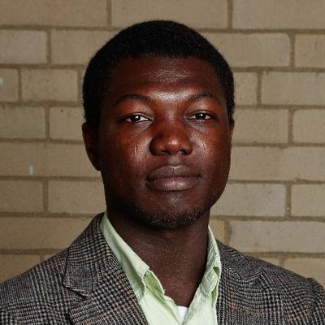
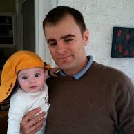

# Overview
Machine learning (ML) models are increasingly being employed to make highly consequential decisions pertaining to employment, bail, parole, and lending. While such models can learn from large amounts of data and are often very scalable, their applicability is limited by certain safety challenges. A key challenge is identifying and correcting systematic patterns of mistakes made by ML models before deploying them in the real world.

The goal of this workshop, held at the [2019 International Conference on Learning Representations (ICLR)](https://iclr.cc/), is to bring together researchers and practitioners with different perspectives on debugging ML models. 

## Speakers
- [Aleksander Madry](https://people.csail.mit.edu/madry/) (MIT)
- [Cynthia Rudin](https://users.cs.duke.edu/~cynthia/) (Duke University)
- [Dan Moldovan](https://ai.google/research/people/DanMoldovan) (Google)
- [Deborah Raji](https://www.linkedin.com/in/deborah-raji-065751b2/) (University of Toronto)
- [Osbert Bastani](https://obastani.github.io/) (University of Pennsylvania)
- [Sameer Singh](http://sameersingh.org/) (UC Irvine)
- [Suchi Saria](https://suchisaria.jhu.edu/) (Johns Hopkins University)

## Schedule 
See [here](https://docs.google.com/document/d/1RoeyDLNup6Ym9ZEJhnMu3z720-5U8LK3FoUfVkUoC0c) for a printable version.

| Time | Event |
| ----- | -------|
| 9.50 | Opening remarks |
| | Session Chair: [Julius Adebayo](http://juliusadebayo.com/) (MIT) |
| 10.00 | **Invited talk** – [Aleksander Madry](https://people.csail.mit.edu/madry/) (MIT): *A New Perspective on Adversarial Perturbations* |
| 10:30 | **Contributed talk** – [Simon Kornblith](http://simonster.com/) (Google): *Similarity of Neural Network Representations Revisited* |
| 10.40 | **Contributed talk** – [Besmira Nushi](https://www.microsoft.com/en-us/research/people/benushi/) (Microsoft Research): *Error terrain analysis for machine learning: Tool and visualizations* |
| 10.50 | Coffee break |
| | Session Chair: [Himabindu Lakkaraju](https://web.stanford.edu/~himalv/) (Harvard University) |
| 11.10 | **Invited talk** – [Osbert Bastani](https://obastani.github.io/) (University of Pennsylvania): *Verifiable Reinforcement Learning via Policy Extraction*|
| 11:40 | **Contributed talk** – [Daniel Kang](https://ddkang.github.io/) (Stanford): *Debugging Machine Learning via Model Assertions* |
| 11:50 | **Contributed talk** – [Benjamin Link](https://www.linkedin.com/in/ben-link-45a5981a) (Indeed): *Improving Jobseeker-Employer Match Models at Indeed Through Process, Visualization, and Exploration* |
| 12.00 | Break|
| | Session Chair: [Sarah Tan](https://shftan.github.io/) (Cornell University / UCSF)|
| 12.10 | **Invited talk** – [Sameer Singh](http://sameersingh.org/) (UC Irvine): *Discovering Natural Bugs Using Adversarial Data Perturbations* |
| 12.40 | **Invited talk** – [Deborah Raji](https://www.linkedin.com/in/deborah-raji-065751b2/) (University of Toronto): *"Debugging" Discriminatory ML Systems* |
| 1.00 | **Contributed talk** – [Tomer Arnon](https://www.linkedin.com/in/tomerarnon/) and [Christopher Lazarus](https://www.linkedin.com/in/christopherlazarus/): *NeuralVerification.jl: Algorithms for Verifying Deep Neural Networks* |
| 1.10 | Lunch |
| 2.30 | Break |
| | Session Chair: [D Sculley](https://www.eecs.tufts.edu/~dsculley/) (Google) |
| 3.20 | Welcome back remarks |
| 3.30 | **Invited talk** – [Suchi Saria](https://suchisaria.jhu.edu/) (Johns Hopkins University): *Safe and Reliable Machine Learning: Preventing and Identifying Failures* |
| 4.00 | **Invited talk** – [Dan Moldovan](https://ai.google/research/people/DanMoldovan) (Google): *Better Code for Less Debugging with AutoGraph* |
| 4.20 | **Posters & Demos** & Coffee break   [Accepted posters](#posters) &nbsp; [Accepted demos](#demos) |
| | Session Chair: [Himabindu Lakkaraju](https://web.stanford.edu/~himalv/) (Harvard University) |
| 5.20 | **Contributed position paper** – [Michela Paganini](https://mickypaganini.github.io/) (Facebook): *The Scientific Method in the Science of Machine Learning* |
| 5.30 | **Invited opinion piece** – [Cynthia Rudin](https://users.cs.duke.edu/~cynthia/) (Duke University): *Don't debug your black box, replace it* |
| 6.00 | **Q&A and panel with all invited speakers** – "The Future of ML Debugging"  Moderator: [Himabindu Lakkaraju](https://web.stanford.edu/~himalv/) (Harvard University)   Panelists: [Aleksander Madry](https://people.csail.mit.edu/madry/), [Cynthia Rudin](https://users.cs.duke.edu/~cynthia/), [Dan Moldovan](https://ai.google/research/people/DanMoldovan), [Deborah Raji](https://www.linkedin.com/in/deborah-raji-065751b2/), [Osbert Bastani](https://obastani.github.io/), [Sameer Singh](http://sameersingh.org/), [Suchi Saria](https://suchisaria.jhu.edu/) |
| 6.25 | Closing remarks |

## Posters
[Call for submissions](https://drive.google.com/open?id=17ccUz0F1kD9JEQC1LIrBeJNpH3xTf2w-esZWyZMjsto) (deadline has passed)
- [Discovery of Intersectional Bias in Machine Learning Using Automatic Subgroup Generation](cameraready/DebugML-19_paper_3.pdf). Angel Cabrera, Minsuk Kahng, Fred Hohman, Jamie Morgenstern and Duen Horng Chau
- [Calibration of Encoder Decoder Models for Neural Machine Translation](cameraready/DebugML-19_paper_12.pdf). Aviral Kumar and Sunita Sarawagi.
- [Step-wise Sensitivity Analysis: Identifying Partially Distributed Representations for Interpretable Deep Learning](cameraready/DebugML-19_paper_7.pdf). Botty Dimanov and Mateja Jamnik
- [Handling Bias in AI Using Simulation](cameraready/DebugML-19_paper_13.pdf). Daniel McDuff, Roger Cheng and Ashish Kapoor
- [Inverting Layers of a Large Generator](cameraready/DebugML-19_paper_18.pdf). David Bau, Jun-Yan Zhu, William Peebles, Hendrik Strobelt, Jonas Wulff, Bolei Zhou and Antonio Torralba
- [MAST: A Tool for Visualizing CNN Model Architecture Searches](cameraready/DebugML-19_paper_24.pdf). Dylan Cashman, Adam Perer and Hendrik Strobelt.
- [Visualizations of Decision Regions in the Presence of Adversarial Examples](cameraready/DebugML-19_paper_6.pdf). Grzegorz Swirszcz, Brendan O'Donoghue and Pushmeet Kohli.
- [BertViz: A Tool for Visualizing Multi-Head Self-Attention in the BERT Model](cameraready/DebugML-19_paper_2.pdf). Jesse Vig.
- [Where To Be Adversarial Perturbations Added? Investigating and Manipulating Pixel Robustness Using Input Gradients](cameraready/DebugML-19_paper_4.pdf). Jisung Hwang, Younghoon Kim, Sanghyuk Chun, Jaejun Yoo, Ji-Hoon Kim and Dongyoon Han.
- [Dissecting Pruned Neural Networks](cameraready/DebugML-19_paper_15.pdf). Jonathan Frankle and David Bau.
- [Monitoring Opaque Learning Systems](cameraready/DebugML-19_paper_25.pdf). Leilani Gilpin.
- [Model Agnostic Globally Interpretable Explanations](cameraready/DebugML-19_paper_5.pdf). Piyush Gupta, Nikaash Puri, Sukriti Verma, Pratiksha Agarwal and Balaji Krishnamurthy.
- [Debugging Trained Machine Learning Models Using Flip Points](cameraready/DebugML-19_paper_11.pdf). Roozbeh Yousefzadeh and Dianne O'Leary.
- [Universal Multi-Party Poisoning Attacks](cameraready/DebugML-19_paper_16.pdf). Saeed Mahloujifar, Ameer Mohammed and Mohammad Mahmoody.
- [Failing Loudly: An Empirical Study of Methods for Detecting Dataset Shift](cameraready/DebugML-19_paper_20.pdf). Stephan Rabanser, Stephan Guennemann and Zachary Lipton.
- [Empirically Measuring Concentration: Fundamental Limits on Intrinsic Robustness](cameraready/DebugML-19_paper_19.pdf). Xiao Zhang, Saeed Mahloujifar, Mohammad Mahmoody and David Evans.
- [Taking a HINT: Leveraging Explanations to Make Vision and Language Models More Grounded](cameraready/DebugML-19_paper_23.pdf). Ramprasaath R. Selvaraju, Stefan Lee, Yilin Shen, Hongxia Jin, Shalini Ghosh, Dhruv Batra and Devi Parikh.
- [Similarity of Neural Network Representations Revisited](cameraready/DebugML-19_paper_9.pdf). Simon Kornblith, Mohammad Norouzi, Honglak Lee and Geoffrey Hinton (Contributed talk).
- [NeuralVerification.jl: Algorithms for Verifying Deep Neural Networks](cameraready/DebugML-19_paper_22.pdf). Changliu Liu, Tomer Arnon, Christopher Lazarus and Mykel Kochenderfer (Contributed talk).
- [Debugging Machine Learning via Model Assertions](cameraready/DebugML-19_paper_27.pdf). Daniel Kang, Deepti Raghavan, Peter Bailis and Matei Zaharia (Contributed talk).
- [The Scientific Method in the Science of Machine Learning](cameraready/DebugML-19_paper_26.pdf). Jessica Zosa Forde and Michela Paganini (Contributed talk).

## Demos
[Call for submissions](https://drive.google.com/open?id=1vrhn7FhsCbYULF5To-Hgcec9s8kpMR5K7jhQtFzsjRo) (deadline has passed)
- [Operationalising Risk Management for Machine Learning: Building a Protocol-Driven System for Performance, Explainability, and Fairness](cameraready/DebugML-19_paper_30.pdf). Imran Ahmed, Giles L. Colclough, Daniel First and QuantumBlack contributors.
- [Building Models for Mobile Video Understanding](cameraready/DebugML-19_paper_33.pdf). Franck Ngamkan and Geneviève Patterson.
- [Debugging Large Scale Deep Recommender Systems using uncertainty estimations and attention](cameraready/DebugML-19_paper_34.pdf). Inbar Naor, Ofer Alper, Dan Friedman and Gil Chamiel
- [Adversarial Examples for Electrocardiograms](cameraready/DebugML-19_paper_36.pdf). Xintian Han, Yuxuan Hu, Luca Foschini, Lior Jankelson and Rajesh Ranganath.
- [Debuggable Machine Learning with ConX and Comet.ml](cameraready/DebugML-19_paper_38.pdf). Cecelia Shao and Douglas Blank.
- [Evidence Based Debugging with DRL-Monitor](cameraready/DebugML-19_paper_39.pdf). Giang Dao and Minwoo Lee.
- [Black Box Attacks on Transformer Language Models](cameraready/DebugML-19_paper_43.pdf). Vedant Misra
- [Improving Jobseeker-Employer Match Models at Indeed Through Process, Visualization, and Exploration](cameraready/DebugML-19_paper_40.pdf). Benjamin Link, Eric Lawrence, Rosemarie Scott, Aaron Pigeon and Jon Witte (Contributed talk).
- _MODHILL: A framework for debugging gait in multi-factor authentication systems_. Vinay Prabhu, John Whaley and Mihail D.
- _Who learns? A microscope into neural network training by measuring per-parameter learning_. Janice Lan, Rosanne Liu, Hattie Zhou and Jason Yosinski.
- _TensorWatch: A Multifaceted System for the Deep Learning Debugging and Visualization_. Shital Shah, Roland Fernandez and Steven Drucker.
- _Error terrain analysis for machine learning: Tool and visualizations_. Rick Barraza, Russell Eames, Yan Esteve Balducci, Josh Hinds, Scott Hoogerwerf, Eric Horvitz, Ece Kamar, Jacquelyn Krones, Josh Lovejoy, Parham Mohadjer, Ben Noah and Besmira Nushi (Contributed talk).

## Topics
- Debugging via **interpretability**: How can interpretable models and techniques aid us in effectively debugging ML models?

- **Program verification** as a tool for model debugging: Are existing program verification frameworks readily applicable to ML models? If not, what are the gaps that exist and how do we bridge them?

- **Visualization** tools for debugging ML models: What kind of visualization techniques would be most effective in exposing vulnerabilities of ML models?

- **Human-in-the-loop** techniques for model debugging: What are some of the effective strategies for using human input and expertise for debugging ML models?

- Novel **adversarial** attacks for highlighting errors in model behavior: How do we design adversarial attacks that highlight vulnerabilities in the functionality of ML models?

- **Theoretical correctness** of model debugging techniques: How do we provide guarantees on the correctness of proposed debugging approaches? Can we take cues from statistical considerations such as multiple testing and uncertainty to ensure that debugging methodologies and tools actually detect ‘true’ errors?

- Theoretical guarantees on the **robustness** of ML models: Given a ML model or system, how do we bound the probability of its failures?

- Insights into **errors or biases of real-world ML systems**: What can we learn from the failures of widely deployed ML systems? What can we say about debugging for different types of biases, including discrimination? 

- **Best practices** for debugging large-scale ML systems: What are standardized best practices for debugging large-scale ML systems? What are existing tools, software, and hardware, and how might they be improved? 

- **Domain-specific nuances** of debugging ML models in healthcare, criminal justice, public policy, education, and other social good applications.

See a [list of references](https://docs.google.com/document/d/1rhkYP23XBygwVPJRZTzU0x98wB-NxvQ_yd-pFbplEzE).

## Organizers

  

     
    <a href="https://web.stanford.edu/~himalv/">Himabindu Lakkaraju</a> 
    Harvard University
  

  
  

  

  
  

     
  <a href="https://shftan.github.io/">Sarah Tan</a> 
    Cornell University / UCSF 
  

  
  

  

  
  

     
  <a href="http://juliusadebayo.com/">Julius Adebayo</a> 
    MIT
  

  
  

  

  
  

     
  <a href="https://www.stat.berkeley.edu/~jsteinhardt/">Jacob Steinhardt</a> 
    Open Philanthropy Project / OpenAI
  

  

     
    <a href="https://www.eecs.tufts.edu/~dsculley/">D Sculley</a> 
    Google
  

  
  

  

  
  

     
  <a href="https://www.microsoft.com/en-us/research/people/rcaruana/">Rich Caruana</a> 
    Microsoft Research
  

## Contact Us
Email [debugging.ml@gmail.com](mailto:debugging.ml@gmail.com) any questions.

## Sponsors

  

    
  

  
  

  

  
  

    
  

  

## Program Committee

| --- | --- |
| Samira Abnar (University of Amsterdam) | Lezhi Li (Uber) |
| David Alvarez Melis (MIT) | Anqi Liu (Caltech) |
| Forough Arabshahi (Carnegie Mellon University) | Yin Lou (Ant Financial) |
| Kamyar Azzizzadenesheli (UC Irvine) | David Madras (University of Toronto / Vector Institute) |
| Gagan Bansal (University of Washington) | Sara Magliacane (IBM Research) |
| Osbert Bastani (University of Pennsylvania) | Momin Malik (Berkman Klein Center) |
| Joost Bastings (University of Amsterdam) | Matthew Mcdermott (MIT) |
| Andrew Beam (Harvard University) | Smitha Milli (UC Berkeley) |
| Kush Bhatia (UC Berkeley) | Shira Mitchell () |
| Umang Bhatt (Carnegie Mellon University) | Tristan Naumann (Microsoft Research) |
| Cristian Canton (Facebook) | Besmira Nushi (Microsoft Research) |
| Arthur Choi (UCLA) | Saswat Padhi (UCLA) |
| Grzegorz Chrupala (Tilburg University) | Emma Pierson (Stanford University) |
| Sam Corbett-Davies (Facebook) | Forough Poursabzi-Sangdeh (Microsoft Research) |
| Amit Dhurandhar (IBM Research) | Manish Raghavan (Cornell University) |
| Samuel Finlayson (Harvard Medical School, MIT) | Ramya Ramakrishnan (MIT) |
| Tian Gao (IBM Research) | Alexander Ratner (Stanford University) |
| Efstathios Gennatas (UCSF) | Andrew Ross (Harvard University) |
| Siongthye Goh (Singapore Management University) | Shibani Santurkar (MIT) |
| Albert Gordo (Facebook) | Prasanna Sattigeri (IBM Research) |
| Ben Green (Harvard University) | Peter Schulam (Johns Hopkins University) |
| Jayesh Gupta (Stanford University) | Ravi Shroff (NYU) |
| Satoshi Hara (Osaka University) | Camelia Simoiu (Stanford University) |
| Tatsunori Hashimoto (MIT) | Sameer Singh (UC Irvine) |
| He He (NYU) | Alison Smith-Renner (University of Maryland) |
| Fred Hohman (Georgia Institute of Technology) | Jina Suh (Microsoft Research) |
| Lily Hu (Harvard University) | Adith Swaminathan (Microsoft Research) |
| Xiaowei Huang (University of Liverpool) | Michael Tsang (University of Southern California) |
| Yannet Interian (University of San Francisco) | Dimitris Tsipras (MIT) |
| Saumya Jetley (University of Oxford) | Berk Ustun (Harvard University) |
| Shalmali Joshi (Vector Institute) | Gilmer Valdes (UCSF) |
| Yannis Kalantidis (Facebook) | Paroma Varma (Stanford University) |
| Ece Kamar (Microsoft Research) | Kush Varshney (IBM Research) |
| Madian Khabsa (Facebook) | Fulton Wang (Sandia National Labs) |
| Heidy Khlaaf (Adelard) | Yang Wang (Uber) |
| Pang Wei Koh (Stanford University) | Fanny Yang (ETH Zurich) |
| Josua Krause (Accern) | Jason Yosinski (Uber) |
| Ram Kumar (Microsoft / Berkman Klein Center) | Muhammad Bilal Zafar (Bosch Center for Artificial Intelligence) |
| Isaac Lage (Harvard University) | Xuezhou Zhang (University of Wisconsin-Madison) |
| Finnian Lattimore (Australian National University) | Xin Zhang (MIT) |
| Marco Tulio Ribeiro (Microsoft Research) | |
